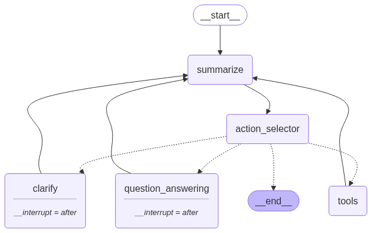
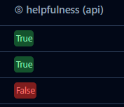
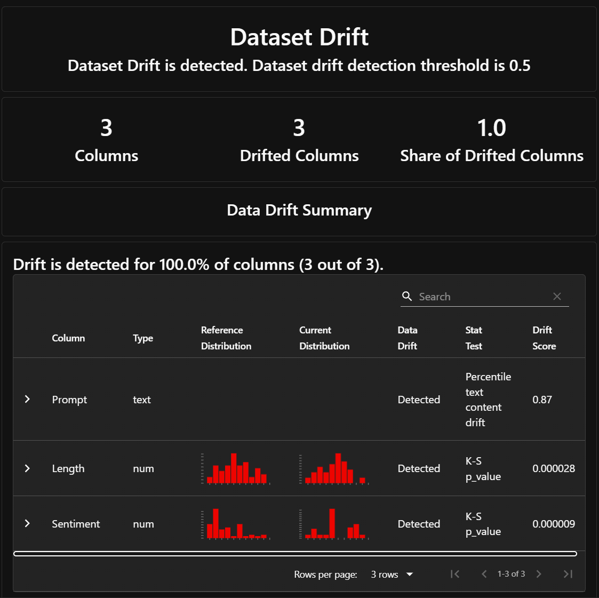
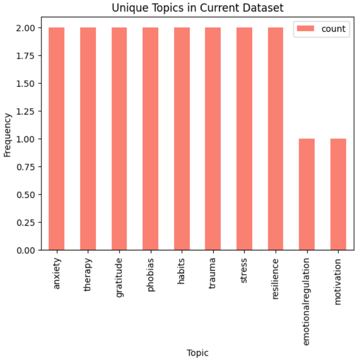

# MCP Enabled Psychotherapy RAG and Web Agent with Azure Cloud Deployment

Psy AI is an agent that leverages local Ollama Llama 3.1 8b model together with RAG and web capabilites to provide insights based on user input. Its prompting is optimized to psychology, psychotherapy, and psychiatry to help user in most professional yet caring manner.

## Components

### Local Ollama Qwen 2.5 14b Agent (agent.py)
The Psy AI assistant is built using the locally hosted Qwen 2.5 14b model, which serves as the foundational language model for the system. Tests were conducted using Nvidia Geforce RTX 4090, which provided low latency during model interactions. If you wish, you can substitute the default model with any desired one, whether based on API or local.

### LangGraph Architecture

The internal logic of the agent is based on LangGraph framework. This graph controls the flow of actions, retrievals, and state management. The agent dynamically updates its knowledge and state as it interacts with the user and tools at disposal.



### LlamaIndex Retrieval-Augmented Generation
The agent uses LlamaIndex, which powers the RAG process. The assistant utilizes RAG to intelligently retrieve relevant information from local knowledge base documents, ensuring that responses are grounded in accurate, contextually relevant data.

The assistant interacts with a vector database, such as ChromaDB, to access indexed knowledge. This enables the system to answer complex queries by fetching related documents and using them in conjunction with the language model to generate responses. This approach enhances the assistant’s ability to provide precise and well-informed answers based on external knowledge beyond its pre-existing training.

### Tavily
In addition to the RAG system, the assistant is equipped with Tavily Web, allowing it to fetch real-time data from the web when necessary. This integration ensures that the assistant can go beyond its internal knowledge base and offer up-to-date, web-sourced information when answering user questions that require more current or specific data.

### MCP Tools and Prompts Serving
There is local MCP client/server integration which serves the tools and prompts to the agent through Model Context Protocol. This solution can be extended to be used with remote MCP server over HTTP.

### Streamlit Interface

The Streamlit app provides a conversational interface. Users input their queries, and the agent processes and responds accordingly. The app maintains session state, keeping track of the conversation history.


## App Launch

## Prerequisites
- Python 3.12 or higher
- UV package manager
- Docker
- Azure CLI
- Llama model being served on port `8000`
- Embedding model being served on port `11434`
- Generate [Tavily API key](https://app.tavily.com/)

### UV Streamlit run
- Create an env file at the root of project with vars depending on your intended use.
```
TAVILY_API_KEY=
LANGCHAIN_TRACING_V2=
LANGCHAIN_API_KEY=
TEXT_GENERATION_MODEL_NAME=
LLM_ADDRESS=
EMBEDDING_MODEL_ADDRESS=
PROMETHEUS_ENABLED=
PROMETHEUS_BIND_ADDRESS=
LANGFUSE_MONITORING=
PROMETHEUS_GRAFANA_MONITORING=
LANGFUSE_PUBLIC_KEY=
LANGFUSE_SECRET_KEY=
LANGFUSE_HOST=
```
- Run command below to launch streamlit agent
- `uv run streamlit run src/streamlit-app.py`

### Build Docker Image
```bash
# Build the Docker image
docker build -t psy-agent .

# Change the Docker tag (if needed)
docker tag psy-agent:latest psyserviceregistry.azurecr.io/psy-agent
```

### Launch Docker Container
```bash
# Run the Docker container with GPU support and exposed ports
docker run -p 8501:8501 psyserviceregistry.azurecr.io/psy-agent
```

## Azure Cloud Deployment

### Docker Push
```bash
# Login to Azure Container Registry
az acr login --name <psyserviceregistry>

# Push the Docker image to Azure
docker push psyserviceregistry.azurecr.io/psy-agent
```

### Azure AKS Deployment
1. Create a Kubernetes cluster with a CPU pool node.
1. Label the CPU pool node as `pool=cpunode`:
   ```bash
   kubectl label node <node-name> pool=cpunode
   ```
1. Deploy the pod using the YAML configuration file in the `k8s` directory:
   ```bash
   kubectl apply -f k8s/deploy.yml
   ```

## CI/CD pipeline
The repository is configured with **GitHub Actions** for automated deployment. All steps, including Docker build, push, and AKS deployment, are performed automatically upon code changes.

## Monitoring, observability and feedback
- Run `docker compose -f monitoring/docker-compose.yml up`. This will create running containers for following services.
   - Prometheus on port `9094`. 
   - Grafana on port `3094`.
   - Langfuse LLM observability on port `3000`
- Enabling/disabling monitoring is possible with boolean environment vars `LANGFUSE_MONITORING` and `PROMETHEUS_GRAFANA_MONITORING`.

## Prometheus + Grafana monitoring
Variety of metrics are being logged to Prometheus server and displayed by Grafana.


## User feedback
Agent is able to provide the simplest form of user feedback through thumbs up/down buttons under conversations.


## Langfuse observability
All conversation threads are being logged to Langfuse observability platform.
- Session - single conversation thread.

- Trace - single conversation exchange.

- Observation - single llm generation. In our case Langgraph node step.

- Scores - feedback from previous step is being logged to 
 

## Data drift detection
Data drift detection was implemented in a [psychotherapy-model repo](https://github.com/vitaliy-sharandin/psychotherapy-model/tree/main/src/drift-detection).<br>
Data drift detection was performed with: 
- The synthetic user prompts on various topics which were different from training dataset.
- Evidently AI library to detect shift in user input embeddings.

- Manual method which listed top 10 prompt topics from both training and simulated datasets as well as topics unique to simulated dataset only. We will use those topics for our model retraining.



## Retraining
Now we can use drifted topics to gather data for further model fine-tuning. We can perform that with following steps:<br>
1. Gather most frequent drifted topics unique to the current dataset.
1. Extract prompt/response pairs marked by user feedback as "good" or "bad" from Langfuse for topics from previous step.
1. For good responses:
   1. Use human annotator to review responses marked as "good".
   1. If they pass verification, use them in fine-tuning dataset, otherwise correct.
1. For bad responses:
   1. Use language model to generate correct responses.
   1. Use human annotator to verify responses.
   1. Use the corrected dataset for fine-tuning
1. For unmarked responses
   1. Use language model to verify responses and generate correct ones if needed.
   1. Use human annotator to verify responses.
1. Gather all prompt/reponse pairs and fine-tune the model.
